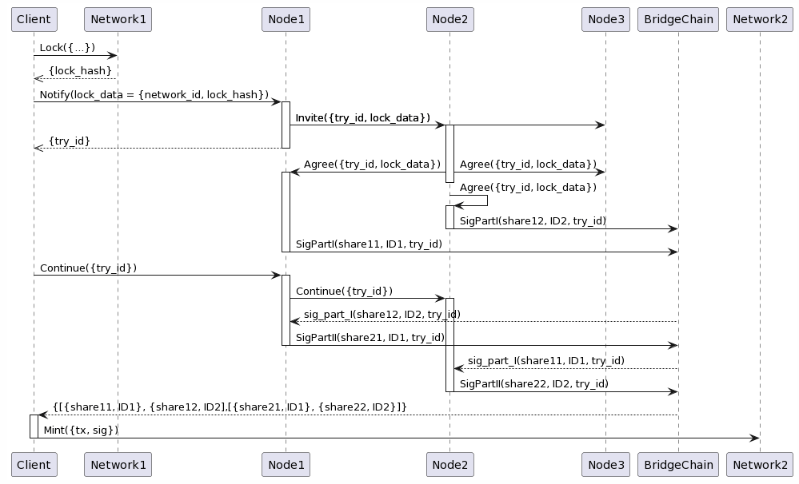

# Основные принципы работы

## Хореография

```
@startuml
!pragma teoz true
Client->Network1: Lock({...})
Client<<--Network1: {lock_hash}
Client->Node1:Notify(lock_data = {network_id, lock_hash})
activate Node1
Node1->Node2: Invite({try_id, lock_data})
activate Node2
&Node1->Node3: Invite({try_id, lock_data})
Client<<--Node1: {try_id}
deactivate Node1

Node2->Node1: Agree({try_id, lock_data})
activate Node1
&Node2->Node3: Agree({try_id, lock_data})
deactivate Node2
Node2->Node2: Agree({try_id, lock_data})
activate Node2
Node2->BridgeChain: SigPartI(share12, ID2, try_id)
deactivate Node2
Node1->BridgeChain: SigPartI(share11, ID1, try_id)
deactivate Node1


Client->Node1: Continue({try_id})
activate Node1
Node1->Node2: Continue({try_id})
activate Node2
Node1<--BridgeChain: sig_part_I(share12, ID2, try_id)
Node1->BridgeChain: SigPartII(share21, ID1, try_id)
deactivate Node1

Node2<--BridgeChain: sig_part_I(share11, ID1, try_id)
Node2->BridgeChain: SigPartII(share22, ID2, try_id)
deactivate Node2

Client<--BridgeChain: {[{share11, ID1}, {share12, ID2],[{share21, ID1}, {share22, ID2}]}
activate Client
Client->Network2:Mint({tx, sig})
deactivate Client
@enduml
```


## Node API

## Структура данных
**Конфигурация**
- node_id
- массив {network_id, key_share}

**Таблица Coalitions**
Содержит текущие статусы сборки подписи
- tx_hash
- network_id
- try_id
- participant_id

# Алгоритмы

## Обработчики на нодах бриджа
### onNotify
Сообщение о факте блокировки средств

Параметры:
- tx_hash
- network_id
```
@startuml
'onNotify
start
  :try_id = new UUID;
  :SaveAgree(try_id, tx_hash, network_id, NODE_ID);
  :broadcast Invite(try_id, tx_hash, network_id, NODE_ID);
stop
@enduml
```

### onInvite
Приглашение в коалицию для сборки подписи

Параметры:
- tx_hash
- network_id
- node_id
- try_id
```
@startuml
'onInvite
start
  :SaveAgree(try_id, tx_hash, network_id, node_id);
  :broadcast Agree(try_id, NODE_ID);
stop
@enduml
```

### onAgree
Отклик о факте согласия на участие в коалиции

Параметры:
- try_id
- node_id
```
@startuml
'onAgree
start
  :agree_count = ReadAgree(try_id);
  if(agree_count >= THRESHOLD) then (yes)
    :mint_tx = generate_unlock_tx(tx_hash, network_id);
    :share1 = generate_share1(mint_tx, secret_share);
    :WriteToBC(SigPartI(share1, NODE_ID));
  endif
stop
@enduml
```

### onAgree
Запрос на старт второго этапа сборки подписи

Параметры:
- try_id
```
@startuml
'onContinue
start
  :broadcast Continue({try_id});
  :[sig1_parts] = ReadSig1Parts();
  if (sig1_parts.length >= THRESHOLD) then (yes)
    :share2 = generate_share2(mint_tx, sig1_parts];
    :WriteToBC(SigPartII(share2, NODE_ID);
  endif
stop
@enduml
```

## Внутренние методы
- generate_try_id() - генерирует идентификатор попытки
- generate_unlock_tx(tx_hash, network_id) - собирает транзакцию разблокировки/минта для целевой сети, основываясь на параметрах транзакции блокировки в сети отправления
- generate_share1(mint_tx, secret_share) - формирует первую часть доли подписи для транзакции с помощью доли секрета
- generate_share2(mint_tx, sig1_parts]) - формирует вторую часть доли подписи для транзакции, основываясь на результатах первого этапа от других участников коалиции
- generate_signature(sig1_parts, sig2_parts) - собирает подпись целиком

## Методы взаимодействия с блокчейнами
- read_lock_data(tx_hash, network_id) - извлекает данные о транзакции блокировки
- is_node_valid(id) - по состоянию confidential layer возвращает данные о том, является ли узел валидным (имеет стейк)

# Смарты confidential layer
## Сборка подписи
### SigPartI
Сохраняет первую часть подписи, сформированную участником id в результате попытки try_id
```
function SigPartI(
        bytes share,
        uint  id,
        uint  try_id
    ) onlyBridge; 
```

### SigPartII
Сохраняет вторую часть подписи, сформированную участником id в результате попытки try_id
```
function SigPartI(
        bytes share,
        uint  id,
        uint  try_id
    ) onlyBridge; 
```
# Смарты Ethereum

## Vault

Хранилище содержит все токены, находящиеся во владении бриджа. Обёрнутые токены создаются vault-ом. Владельцем vault-а является смарт-контракт бриджа.


### deploy
создать новый токен-обёртку
```
function deploy(
        string memory name,
        string memory symbol,
        uint decimals
    ) onlyBridge; 
```

### deposit
перевести токен с баланса пользователя на баланс хранилища
```
function deposit(
        address token,
        address from,
        uint256 amount
    ) onlyBridge;
```

### withdraw
Перевести токен с баланса бриджа на баланс пользователя
```
function withdraw(
        address token,
        address to,
        uint256 amount
    ) onlyBridge;
```

### mint
Сминтить токен на баланс пользователя
```
function mint(
        address token,
        address to,
        uint256 amount
    ) onlyBridge;
```

### burn
Cжечь токен на балансе пользователя
```
function burn(
        address token,
        address from,
        uint256 amount
    ) onlyBridge;
```

### transferOwnership
Передать владение vault-ом новому контакту
```
function transferOwnership(
        address new_bridge
    ) onlyGovernance;
```

### tokenTransferOwnership
Передаёт владение токенами новому контракту vault-а
```
function tokenTransferOwnership(
        address token,
        address new_vault
    ) onlyGovernance;
```
## Bridge
Контракт бриджа является точкой входа для пользователей и имеет два основных метода - lock и claim. 

### setVault
Связать контракт с новым vault-ом
```
function setVault(
        address _vault
    ) onlyGovernance
```
### addNetwork
Добавляет доступную сеть
```
function addNetwork(
        uint network_id,
        uint decimals
    ) onlyGovernance
```
### addOutboundToken
Добавляет доступный для перевода токен, токен должен существовать
```
function addOutboundToken(
        address src_token, //хеш-токена
        uint dst_decimals, //количество децималс у обёртки в сети назначения
        uint network_id, // идентификатор сети назначения
        bool is_native // является ли токен нативным для этой сети
    ) onlyGovernance
```
### lock
Принимает от пользователя токены, передаёт их на баланс vault-а и, в случае успеха, создаёт соответствующее событие в логе.
```
function lock(
        bytes memory dst_address, //адрес получателя в сети назначения
        uint24 dst_network, //идентификатор сети назначения
        uint256 amount, // количество
        address token // токен
    ) checkSetup
```
В соответствии с алгоритмом, смарт-контракт либо переводит на свой счёт, либо сжигает заданное количество активов.

При обработке параметра *amount* учитывается разрядность сети назначения, записанная в массиве *known_networks*. Если *amount* не соответствует разрядности сети назначания, перевод отклоняется.

```
@startuml
start
  if (outbound_tokens[token].is_native) then (yes)
    :Vault.Lock(token, amount);
  else (no)
    :Vault.Burn(token, amount);
  endif
stop
@enduml
```

#### Дробные значения

При получении средств смарт-контракт в сети отправления (метод lock) выполняет проверку возможности перевода средств в сеть отправления, отправка возможна при выполнении условия

```
dst_token_decimals = MIN(origin_token_decimals, target_network_decimals)
ЕСЛИ dst_token_decimals < src_token_decimals
    ЕСЛИ  amount % (10 ** (src_decimals - dst_decimals)) == 0
    ТО    истина
    ИНАЧЕ ложь
ИНАЧЕ истина
```
Значение *dst_amount* вычисляется как
```
ECЛИ  dst_decimals < src_decimals
TO    dst_amount = amount / (10 ** (dst_decimals - src_decimals))
ИНАЧЕ dst_amount = amount * (10 ** (src_decimals - dst_decimals))
```

### claim
Передаёт с контракта vault-а соответствуещее количество хранящихся там токенов на баланс пользователя
```
function claim(
        address dst_address,
        uint256 amount,
        address token
    ) checkSetup onlyGovernance
```